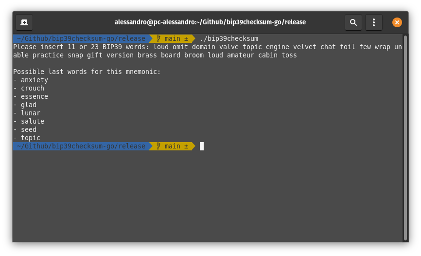

# bip39checksum-go

A simple program written in Go to find the last BIP39 mnemonic word (checksum).

This program test all possible words and print them.

Inspired by: [GitHub - massmux/bip39checksum: BIP39 checksum word finder](https://github.com/massmux/bip39checksum)

## How to run

### Run the program yourself

`go run bip39checksum.go`

### Use the compiled binary (Linux)

1. `chmod +x bip39checksum`

2. `./bip39checksum`

## Verify signature

1. Get my GPG key ([link](https://gist.githubusercontent.com/alex27riva/7892f5c601bc90ca1690839ccdcddeb1/raw/f17cdfebebc91fb137efd98590c3945f58ca0fd8/public.asc))
2. Calculate SHA256 hash of the binary: `sha256sum bip39checksum`
3. Check that the hash is the same in the signature.txt.asc file
4. Verify the signature: `gpg --verify signature.txt.asc`

## Disclamer

This program is provided "as is", I am not responsible for any loss of funds caused by the use of this program.
It is strongly recommended to use it on an offline computer.